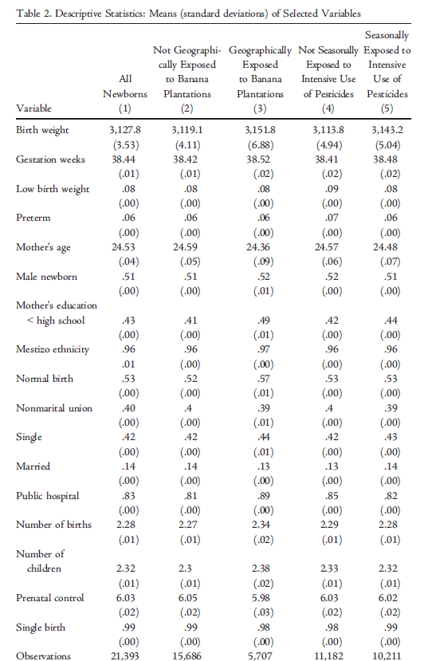
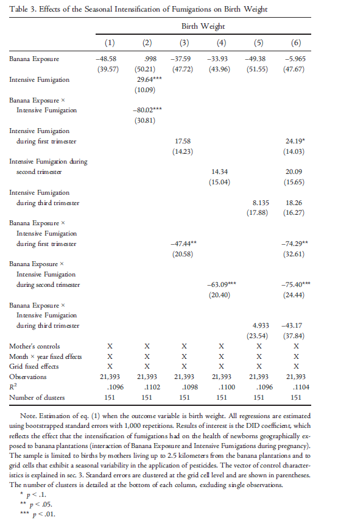
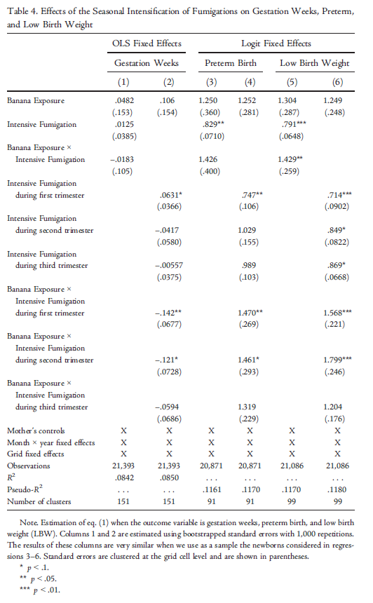
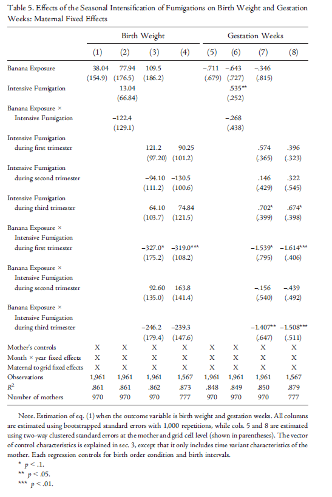
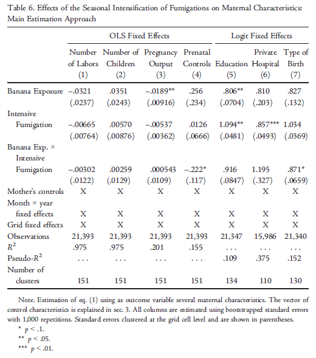

# Introduction 

- Increasing demand for agricultural  productions, combined with land restrictions and changing weather has contribuited to the extensive use of agrochemicals
            
- Issue:This use of chemicals has severe negative effects on the populations living close to the farms or working on them
            
* But, still there are few studies analyzing the effects of enviromental pollution on health outcomes
            
+ very few that leverage quasi-experimental variation to estimate the health effects of the use of pesticides in agriculture
            
 - Goal of this paper: examine the effects of pesticides used in banana plantations in Ecuador on newborn's health outcomes


# Empirical Strategy

- DiD approach that exploits the seasonal changes in the fumigation of banana plantations as an identification strategy
- 4 newborn's health outcomes: weight at birth, gestational length, low birth weight, and preterm
- Use of mother's address durirng pregancy and precise information on the perimeter of the plantations to compute measures of exposure to air pollution
- Compute the mother's distance from the plantation and the area of fumigated plantations near their place of residence


$$
 Y_{ijmy} = \beta_{0} + \beta_{1}\text{Banana Exposure}_{ijmy} + \beta_{2}\text{Intensive Fumigations}_{ijmy} + \\ \theta \text{Banana Exposure}_{ijmy} \times \text{Intensive Fumigations}_{ijmy} + \\  \delta X_{i} + \mu_{j} + \psi_{m} + \pi_{y} + \epsilon_{ijmy} 
$$

$$
 Y_{ijmy} = \beta_{0} + \beta_{1}\text{Banana Exposure}_{ijmy} + \sum_{z=1}^{3} \beta_{z} Z^{th}\text{Intensive Fumigations}_{ijmy} + \\  \sum_{z=1}^{3} \theta_{z} Z^{th}\text{Banana Exposure}_{ijmy} \times   Z^{th}\text{Intensive Fumigations}_{ijmy} + \\  \delta X_{i} + \mu_{j} + \psi_{m} + \pi_{y} + \epsilon_{ijmy}
$$


in which:

- $Y_{ijmy}$: birth outcomes of newborn $i$, in a grid cell $j$, month $m$ and year 
- $\text{Banana Exposure}_{ijmy}$: is a dummy variable that takes the value 1 for newborns from mothers geographically exposed to pesticides
 - $\text{Intensive Fumigations}_{ijmy}$: is a dummy variable that takes the value 1 for newbornds that were affected by intensive fumigations for at least theree months during gestation
- $Z^{th}\text{Intensive Fumigations}_{ijmy}$: is a dummy variable that takes the value 1 for the newbornds that were affected by intensive fumigations during the three months of the $Z^{th}$ gestation trimester.
 - $X$: vector of controls

## Loading Data
As most of R projects, we use several third party packages to perform the replication. Make sure the ones below are properly installed in your machine.

```{r, message=FALSE, warning=FALSE}
## 1. Load Packages
library(tidyverse) # Easily Installand Load the 'Tidyverse'
library(lubridate) # Make Dealing with Dates a Little Easier
library(janitor) # Simple Tools for Examining and Cleaning Dirty Data
library(data.table) # Extension of `data.frame`
library(tidylog) # Logging for 'dplyr' and 'tidyr' Functions
library(haven) # Open .xpt and Stata (.do) files
library(foreign) # Read and Write Data from Other Statistical Systems
library(Hmisc) # Harrell Miscellaneous. Used to extract .dta file label easily
library(htmltools) # Tools for HTML
library(lintr) # Trying to removing the annoying lint
library(gt) # Easily Create Presentation-Ready Display Tables
library(gtExtras) # Additional Functions to Enhance 'gt'
library(broom) # Convert Statistical Analysis Objects into Tidy Tibbles
library(boot) # Bootstrap Functions for R
library(lfe) # Linear Group Fixed Effects
library(sandwich) # For robust standard errors
library(lmtest) # For coefficient testing with robust standard errors
library(plm) # Panel Data Models - to perform OLS with FE
library(tidyr) # Easily Tidy Data with 'spread()' and 'gather()' Functions
library(tidycat) # Tidy Categorical Data with 'tidycat'
library(fixest) # Fast and User-Friendly Fixed-Effects Estimations
library(here)
knitr::opts_chunk$set(fig.width=8, fig.height=8) 
```

Since the original paper was run using Stata, their data were published in three .dta files. 
"bananas1.dta" is the main data set used throughout he paper. Its has unindentifies newborns` data and it used to perform most of regressions. "bananas2.dta" contains data to perform the maternal fixed effects regression presented on table 5.
```{r, message=FALSE, warning=FALSE}
bananas1.R = read_dta("bananas1.dta") # Main data set used on the papaer
bananas2.R = read_dta("bananas2.dta") # data set used to generate the tables with maternal fixed effects
bananas1 = bananas1.R %>% clean_names() # Clean the column names
bananas2 = bananas2.R %>% clean_names() # Clean the column names
```

For **Newborn's health**, the authors collected data from:
        
- data set from the National Register of Live Births for the period 2015-17  (information on the mother's residential addresses during pregancy)
 - data set includes information on several observable characteristics of children and mothers
On the other hand, the data set containing information about  **Ecuador's banana plantations:** came from:
 - 2013 agricultural census
 - 2016-18 register of aerial fumigations (geocoded data on the application of the pesticide)


### Table 2

The original descriptive statistics table from the paper:



<br>

#### Table 2 <span style="color:blue">replicated</span>

Here is the code, we've used to replicate the table:

```{r, message=FALSE, warning=FALSE}

## 2. Load Data
bananas1.R <- read_dta("bananas1.dta") # Main dataset used on the papaer
bananas2.R <- read_dta("bananas2.dta") # Dataset used to generate the tables with maternal fixed effects
#bananas3.R <- read_dta("bananas3.dta") # Dataset used to generate the tables that examine the effects of pesticides in other crop plantations - not necessary here

bananas1 <- bananas1.R %>% clean_names() # Clean the column names
bananas2 <- bananas2.R %>% clean_names() # Clean the column names
#bananas3 <- bananas3.R %>% clean_names() # Clean the column names

GetBananasVariableDescription <- function(dataset) {
    dataset_length <- dim(dataset)[2] # Get the number of rows
    dataset_labels <- sapply(dataset, function(column) attr(column, "label")) # Get the labels of the columns (its a messy list)
    dataset_types <- sapply(dataset, function(column) attr(column, "format.stata"))
    dataset_variables_description <- tibble(column_name = NA, label = NA, format = NA) # Create a tibble to store the variables description
    for (i in c(1:dataset_length)) {
        dataset_variables_description[i, 1] <- names(dataset[i])
        dataset_variables_description[i, 2] <- dataset_labels[[i]]
        dataset_variables_description[i, 3] <- dataset_types[[i]]
    } # complete the tibble with the variables description. First column: each name, second column: each label
    return(dataset_variables_description)
}

bananas1_variables_description <- GetBananasVariableDescription(bananas1)
bananas1_variables_description %>% print(n = 100)
bananas2_variables_description <- GetBananasVariableDescription(bananas2)
#bananas3_variables_description <- GetBananasVariableDescription(bananas3)
tom_azul = "#21549d"
#unique(bananas1$educ)
## 4. Make Table 2
columns_table2 <- c(
    "weight", "gweeks", "lbw", "preterm", "age", "dsex1", "deduc1",
    "dethnic6", "tlabor1", "dmarital1", "dmarital2", "dmarital3",
    "dprivate1", "labors", "nchild", "visits", "dnbl1", "esample", "bx", "pxp"
)

colwise_function <- function(data, func, group) {
    func_name <- deparse(substitute(func)) # Get the name of the function
    results <- apply(data, MARGIN = 2, FUN = func, na.rm = TRUE)
    results <- as.list(results) # Transform the means into a list
    results <- tibble(column_name = names(results), mean = unlist(results))
    colnames(results) <- c("column_name", paste0(func_name, "_", group))
    return(results)
} # Generic function to apply a function to each column of a dataframe

colwise_merge <- function(data, group) {
    data1 <- colwise_function(data, mean, group)
    data2 <- colwise_function(data, sd, group)

    merged_data <- full_join(data1, data2, by = "column_name")
    return(merged_data)
} # Generic function to merge two dataframes by the column_name

table2 <- bananas1 %>% subset(select = columns_table2) # Subset data to get the variables used in table 2

table2_1 <- table2 %>% filter(esample == 1) # esample: newborn present in final sample (just 21 observations have newsample != 1)
table2_1 <- table2_1 %>% select(-c(esample, bx, pxp)) # Remove the esample column
table_2_1_observations <- dim(table2_1)[1] # Get the number of observations
table2_1_results <- colwise_merge(table2_1, 1) # Get means and std for this group

table2_2 <- table2 %>% filter(esample == 1, bx == 0) # bx = dummy for exposure to pesticides (1 = yes)
table2_2 <- table2_2 %>% select(-c(esample, bx, pxp)) # Remove the esample and bx columns
table_2_2_observations <- dim(table2_2)[1] # Get the number of observations
table2_2_results <- colwise_merge(table2_2, 2)

table2_3 <- table2 %>% filter(esample == 1, bx == 1)
table2_3 <- table2_3 %>% select(select = -c(esample, bx, pxp)) # Remove the esample column
table_2_3_observations <- dim(table2_3)[1] # Get the number of observations
table2_3_results <- colwise_merge(table2_3, 3) # Get means and std for this group

table2_4 <- table2 %>% filter(esample == 1, pxp == 0) # pxp: exposure to pesticides
table2_4 <- table2_4 %>% select(select = -c(esample, bx, pxp)) # Remove the esample column
table_2_4_observations <- dim(table2_4)[1] # Get the number of observations
table2_4_results <- colwise_merge(table2_4, 4) # Get means and std for this group

table2_5 <- table2 %>% filter(esample == 1, pxp == 1) # pxp: exposure to pesticides
table2_5 <- table2_5 %>% select(select = -c(esample, bx, pxp)) # Remove the esample column
table_2_5_observations <- dim(table2_5)[1] # Get the number of observations
table2_5_results <- colwise_merge(table2_5, 5) # Get means and std for this group
#table_2_5_observations
table2_results <- full_join(table2_1_results, table2_2_results, by = "column_name") # Merge the results
table2_results <- full_join(table2_results, table2_3_results, by = "column_name") # Merge the results
table2_results <- full_join(table2_results, table2_4_results, by = "column_name") # Merge the results
table2_results <- full_join(table2_results, table2_5_results, by = "column_name") # Merge the results

table2 <- table2_results
table2[,1] = c('Weight', 
'Gestation Weeks', 
'I(Low Birth Weight)', 
'I(Preterm Birth)', 
'Mother Age', 
'I(Newborn Male)',
'I(Mother Education < High School)',
'I(Newborn Mestizo)',
'I(Normal Birth)',
'I(Mother has Nonmarital Union)',
'I(Mother is Single)',
'I(Mother is Married)',
'I(Born in Public Hospital)',
'No. of Previous Labors',
'No. of Other Children',
'No. of Prenatal Care Visits',
'I(Not Twins)')
nrows_table <- nrow(table2)

table2[, c(2, 4, 6, 8, 10)] <- lapply(table2[, c(2, 4, 6, 8, 10)], function(x) as.character(round(x, 3)))
table2[, c(3, 5, 7, 9, 11)] <- lapply(table2[, c(3, 5, 7, 9, 11)], function(x) as.character(round(x, 2)))
#table2
for (i in 1:nrow(table2)) {
    j <- nrow(table2)
    table2 <- table2 %>% add_row(.before = ((j - nrows_table) + (i + 1)))
    #print(table2)
}
```


```{r, message=FALSE, warning=FALSE}
for (i in seq(1, nrow(table2), by = 2)) {
    for (j in c(3, 5, 7, 9, 11)) {
        table2[i + 1, j - 1] <- paste0("(", table2[i, j], ")")
    }
}
table2 <- table2 %>% subset(select = c(1, 2, 4, 6, 8, 10))


table2 <- table2 %>% add_row(
    column_name = "No. of Observations",
    mean_1 = as.character(table_2_1_observations),
    mean_2 = as.character(table_2_2_observations),
    mean_3 = as.character(table_2_3_observations),
    mean_4 = as.character(table_2_4_observations),
    mean_5 = as.character(table_2_5_observations)
)


table2_gt <- gt(table2)

# Create titles
table2_gt <- table2_gt %>%
    tab_header(
        title = md("**Table 2**"),
        subtitle = "Descriptive Statistics: Means (standard deviations) of Selected Variables"
    ) # Create titles
#table2_gt

# Create footnotes
table2_gt <- table2_gt %>%
    tab_source_note(source_note = md("*bx* = I(Banana Exposure)")) %>%
    tab_source_note(source_note = md("*pxp* = I(Intensive Fumigation)"))
#table2_gt

# Rename columns
table2_gt <- table2_gt %>%
    cols_label(
        column_name = "",
        mean_1 = md("**Subset 1:** <br> All Newborns"),
        mean_2 = md("**Subset 2:** <br> bx = 0"),
        mean_3 = md("**Subset 3:** <br> bx = 1"),
        mean_4 = md("**Subset 4:** <br> pxp = 0"),
        mean_5 = md("**Subset 5:** <br> pxp = 1")
    )
#table2_gt

# Align columns properly
table2_gt <- table2_gt %>%
    cols_align(
        align = "center",
        columns = everything()
    ) %>%
    cols_align(
        align = "left",
        columns = 1
    )
#table2_gt

# Remove all NAs from the table
table2_gt <- table2_gt %>%
    text_case_match(
        NA ~ " ",
        .locations = cells_body(columns = everything())
    )
#table2_gt

# Set columns width
table2_gt <- table2_gt %>%
    cols_width(
        1 ~ px(200),
        c(2, 3, 4, 5, 6) ~ px(120)
    )
#table2_gt

# Make coefficients bold
table2_gt <- table2_gt %>%
    tab_style_body(
        style = list(
            cell_text(color = "#000000", weight = "bold"),
            cell_fill(color = "#ffffff")
        ),
        values = c("weight"),
        targets = "column"
    )
#table2_gt

# Remove horizontal lines of CI rows
table2_gt <- table2_gt %>%
    tab_style(
        style = list(
            cell_borders(
                sides = c("bottom"),
                color = "#FFFFFF",
                weight = px(2)
            )
        ),
        locations = list(
            cells_body(
                columns = everything(),
                rows = c(seq(1,35,2))
            )
        )
    )
#table2_gt

# Change colors of the borders (tom_azul is set in the beginning of the script)
table2_gt <- table2_gt %>%
    tab_options(
        table.border.top.width = px(4),
        table.border.top.color = tom_azul,
        table.border.bottom.width = px(4),
        table.border.bottom.color = tom_azul,
        heading.border.bottom.width = px(2),
        heading.border.bottom.color = tom_azul,
        column_labels.border.top.width = NULL,
        column_labels.border.top.color = NULL,
        column_labels.border.bottom.width = px(2),
        column_labels.border.bottom.color = tom_azul,
        table_body.border.bottom.width = NULL,
        table_body.border.bottom.color = tom_azul,
        footnotes.border.bottom.color = tom_azul
    )

table2_gt
```


#  Reduced Form estimations

Firstly, here is the setup used for the replication of the regressions. As all regressions follow the same structure, we built several functions that manually perform them. Here`s a step by step guide.

First, we needed to know what each single variable stands for. As .dta files contains multiple levels of data, we we developed the function "GetBananasDescription()" to specifically retrieve this information and display it.

As an example, here it is a data frame with the names, description and format of all the 68 variables in "bananas1.dta".
```{r, message=FALSE, warning=FALSE}
GetBananasVariableDescription = function(dataset) {
    dataset_length = dim(dataset)[2] # Get the number of rows
    dataset_labels = sapply(dataset, function(column) attr(column, "label")) # Get the labels of the columns (its a messy list)
    dataset_types = sapply(dataset, function(column) attr(column, "format.stata"))
    dataset_variables_description = tibble(column_name = NA, label = NA, format = NA) # Create a tibble to store the variables description
    for (i in c(1:dataset_length)) {
        dataset_variables_description[i, 1] = names(dataset[i])
        dataset_variables_description[i, 2] = dataset_labels[[i]]
        dataset_variables_description[i, 3] = dataset_types[[i]]
    } # complete the tibble with the variables description. First column: each name, second column: each label
    return(dataset_variables_description)
}

bananas1_variables_description = GetBananasVariableDescription(bananas1)
bananas1_variables_description %>% print(n = 100)
bananas2_variables_description = GetBananasVariableDescription(bananas2)
#bananas3_variables_description = GetBananasVariableDescription(bananas3)
```

Also, we needed to properly convert revelant varaibles to specific formats. As described on the paper Stata code, `marital`, `ethnic`, `grid` and `cohort` are all factors variables. They cannot be treated as continous numbers in the regressions.
```{r, message=FALSE, warning=FALSE}
# Make relevant discrete variables as factors
bananas1$marital = as.factor(bananas1$marital)
bananas1$ethnic = as.factor(bananas1$ethnic)
bananas1$grid = as.factor(bananas1$grid)
bananas1$cohort = as.factor(bananas1$cohort)

bananas2$marital = as.factor(bananas2$marital)
bananas2$ethnic = as.factor(bananas2$ethnic)
bananas2$grid = as.factor(bananas2$grid)
bananas2$cohort = as.factor(bananas2$cohort)
bananas2$mfeid = as.factor(bananas2$mfeid)
bananas2 = bananas2 %>%
    mutate(mfeid_grid = interaction(mfeid, grid)) %>%
    drop_na(mfeid_grid) # Create a new variable that is the interaction between the maternal fixed effect and the grid to be used on table 5

no_bootstraps = 100
```

Secondly, we have created some useful functions. These functions will be called on the regression codes and perform all them throughout the code. Let`s go step by step.


1. cluster_sample(data, cluster_var):
In order to get robust standard errors, the authors perform a clusterization based bootstrap. The idea is that, by sampling with replacement the observations, but accounting for some clusters (that is, multiple observations from the same group), they could get more accurate estimates for the SE.

cluster_sample() gets a data set with specified cluster column and outputs a sample (with replacement) of the unique clusters. This sample has the length of the unique clusters list.

`example1` shows this. Given `bananas1` data set and specifying `grid` columns as cluster, the function returns a sample with replacement with 172 objects long (that is the amount of unique elements in `grid`). This will be used to build the bootstrap data set further.
```{r, message=FALSE, warning=FALSE}

## 3. Set up functions
### 3.1. Given a data set with cluster specified, this returns a list with a sample of replacement the size of the unique number of clusters
cluster_sample = function(data, cluster_var) {
    cluster_list = unique(data[[cluster_var]]) # List of unique clusters
    sample_size = length(cluster_list) # Sample size = number of unique clusters (but the sample will have repetitions and non-apperences)

    cluster_sample = sample(cluster_list, sample_size, replace = TRUE) # Sample of the clusters with
    return(cluster_sample)
}

example1 = cluster_sample(data = bananas1, cluster_var = "grid")
example1 # Return a list with lenght = 172 of a sample with replacement from the 172 possible clusters
```

2. boot_dataset(data, cluster_var):
Bootstrapping is about sampling with replacement multiple times the same data set and retrieving statistics from it. boot_dataset() creates one of those reshuffled data set. 

It uses cluster_sample() to make a sample (with replacement) of the unique clusters and then filter the original data set according to it. Notice that is a cluster appear multiple times in the sampled list, boot_dataset() with append it multiple time to the new data set that will be used further on the bootstrapping itself. 

`example2` performs this using `bananas1` and `grid` as cluster again. It provided a shuffle of `bananas1` according to a 172 long sample of the unique values in `grid`. Notice that since different `grid` values have different quantities of linked rows, boot_dataset() will not return a data set as long as the original one (as it would happen in a non-clustered bootstrap).
```{r, message=FALSE, warning=FALSE}
### 3.2. Given a data set with cluster specified, this returns a shuffled data set according to the sample of clusters. Notice that since a cluster may appear multiple times, entire chunks of rows from the original data set will appear multiple times
boot_dataset = function(data, cluster_var) {
    cluster_sample = cluster_sample(data, cluster_var) # sample with repetitions of clusters

    boot_dataset = data.frame() # Empty dataset
    for (i in 1:length(cluster_sample)) {
        temp_dataset = data %>% filter(.[[cluster_var]] == cluster_sample[i]) # temp_dataset = dataset with rows for cluster_sample[i], there will be repetitions and non-apperences
        boot_dataset = bind_rows(boot_dataset, temp_dataset) # Add the rows of the sample to the new dataset
    }
    return(boot_dataset) # It will be a dataset with different size from data. Since some clusters appear more than once, this will happern
}

example2 = boot_dataset(bananas1, "grid")
tibble(example2) %>% head() # This looks like bananas1
dim(example2) # This has the same number os cols, but different number of rows
```

3. set_model(data, dependent_var, independent_var, fixed_effects, remove_var, model_type):
In the paper, the authors only bootstrap the standard errors. The coefficients estimates are found running fixed effects regressions. set_model() gets a data set and specifications for the dependent variable, some of the independent ones, fixed effects, some independent variable to remove and its type (OLS or logit). Then, it runs the desired regression. Notice that since all models in the paper uses most of the same controls for the mother (like age, education, number of children, ...), we built set_model() in such a way that we do not need to specify those controls all time. 

`example3` tests this function using the first regression of table 3 specifications. Notice that it returns the estimates for the coefficients found there (but not the standard errors, that will be bootstrapped).

```{r, message=FALSE, warning=FALSE}
### 3.3. Given data and model specification, this produces a model object that will be used on the bootsrapping itself
set_model = function(data, dependent_var, independent_var, fixed_effects, remove_var, model_type) {
    # Common specifications for all regressions
    dependent_var_str = dependent_var
    independent_var_str = paste(independent_var, collapse = " + ")
    fixed_effects_str = paste(fixed_effects, collapse = " + ")
    mom_controls = c("age", "educ", "private", "labors", "nchild", "visits", "nbl", "sex", "tlabor", "marital")

    if (!is.null(remove_var) && length(remove_var) > 0) {
        mom_controls = setdiff(mom_controls, remove_var)
    } # Remove the variable if it is in the mom_controls list, if not, remains the same

    mom_controls_str = paste(mom_controls, collapse = " + ")
    
    formula_str = paste(dependent_var_str, "~", independent_var_str, "+", mom_controls_str, " | ", fixed_effects_str)
    formula = as.formula(formula_str)
    print("MODEL FORMULA BELOW:")
    print(formula)

    if (model_type == "ols") {
        model = felm(formula, data = data) # Fixed effects linear model
    } else if (model_type == "logit") {
        model = feglm(formula, data = data, family = "logit") # Fixed effects logit model, returns estimates for the coefficients, not the odds ratio
    }
    return(model)
}
```

4. estimate_coefs(data, dependent_var, independent_var, fixed_effects, remove_var, cluster_var, model_type):
Bootstrapping the standard errors is done by getting multiple "boot estimations" for each coefficient and then taking the standard deviation of them. Since we built boot_dataset() in such a way the the clusterization of the observation is taken into account, this process will lead to robust standard errors. estimate_coefs() gets the arguments previously explained and returns *one* estimation for all the coefficients in the model. That is, it return a (1 x number of coefficients) data set with one estimation of them using a bootstraped data set, as described on boot_dataset() function.

`example4` does this using table 3, regression 1 specification. Notice that running this multiple times will resuls in considerables different results, as each time there the model will be run uppon a different data set.
```{r, message=FALSE, warning=FALSE}
### 3.4. Given original data and model specifications, this returns a 1 X n_coeficients dataframe with the estimates of the coefficients based on a clustered resample with repetition data set
estimate_coefs = function(data, dependent_var, independent_var, fixed_effects, remove_var, cluster_var, model_type) {
    boot_data = boot_dataset(data, cluster_var) %>% tibble() # Make the boot dataset that will be used for one estiamtion
    boot_model = set_model(boot_data, dependent_var, independent_var, fixed_effects, remove_var, model_type) # Fit the model

    estimates = tidy(boot_model)
    estimates = estimates %>% subset(select = c(term, estimate)) # Clean results
    estimates = as.data.frame(t(estimates)) # Janitoring
    colnames(estimates) = as.character(unlist(estimates[1, ])) # More janitoring
    estimates = estimates[-1, ] # Remove the first row
    estimates = estimates %>%
        tibble() %>%
        clean_names() # Final df is a 1 x n_coeficients df

    estimates[] = estimates[] %>% lapply(function(x) as.numeric(as.character(x))) # Convert all to numeric
    return(estimates)
}

example4 = estimate_coefs(
    data = bananas1,
    dependent_var = "weight",
    independent_var = c("bx", "ethnic"),
    fixed_effects = c("grid", "cohort"),
    remove_var = NA,
    cluster_var = "grid",
    model_type = "ols"
)
example4 # Returns a 1 x n_coeficients dataframe. Doing this multiple times we will be able to get the distribution of the coefficients and it's robust standard errors
```


5. run_bootstrap(data, dependent_var, independent_var, fixed_effects, remove_var, cluster_var, model_type, n_bootstraps):
We are almost there. estimate_coefs() gets the model coefficients estiamates for one bootstrapped data set. 
run_bootstrap() does that `n_bootstraps` and stores the results in a (n_bootstraps x number of coefficients) data frame.

`example5` tests this. It shows how run_bootstrap() performs estimate_coefs() `n_bootstraps` times.
```{r, message=FALSE, warning=FALSE}
### 3.5. Given a data set, model specifications and the number of bootstraps, this performs the previous algorithm n_bootstraps times and returns a dataframe with the estimates of the coefficients for each bootstrap
run_bootstrap = function(data, dependent_var, independent_var, fixed_effects, remove_var, cluster_var, model_type, n_bootstraps) {
    boot_estimates = tibble()

    for (i in 1:n_bootstraps) {
        coefs_boot_i = estimate_coefs(data, dependent_var, independent_var, fixed_effects, remove_var, cluster_var, model_type)
        coefs_boot_i$no_boot = i
        boot_estimates = bind_rows(boot_estimates, coefs_boot_i)
        print(paste('Bootstrap no.',i))
    }
    return(boot_estimates)
}
```

6. get_results(data, dependent_var, independent_var, fixed_effects, remove_var, cluster_var, model_type, n_bootstraps, regression_number):
Finally, merge all the previous functions into a single one. run_bootstrap() produces the data set we are interested in. Since it has multiple `boot estimates` for each coefficient, the robust standard error is found by simply taking the std. deviation of all `n_bootstraps` estimates. As an excercise, we also take the mean of them to find the `boot estimates` for the coefficients values, although the authors do not use it. The idea is that as `n_bootstraps` grows large, it will get closer to estimates found by estimate_coefs() function.

Also, get_results() cleans the data. It does a lot of janitoring to output a final data set with all coefficients terms names, their estimates found by estimate_coefs(), their `boot estimates`, the robust standard errors, 95% confidence interval and if they are statiscally significant at 95% level. 

Notice that `regression_number` is just an instrument to better present the results. It is useful to create the final tables using \{gt\} package. Just a brief detail.

`example6` does that, again, using table 3 regression 1 specification. Notice that since this process requires a lot of computational power, we have just run the regressions for 100 bootstraps (not 1000, the authors have done). More bootstraps would lead to more accuracy and the mean results of the `boot estimates` would come closer to the estimated coefficients. 

All in all, running all regressions using 100 bootstraps took about 11 hours. Considering linearity, using 1000 bootstraps would take over 4 days.

```{r, message=FALSE, warning=FALSE}
### 3.6. Given the dataframe with the estimates of the coefficients for each bootstrap, this returns a dataframe with the mean and standard deviation of the coefficients
get_results <- function(data, dependent_var, independent_var, fixed_effects, remove_var, cluster_var, model_type, n_bootstraps, regression_number) {
    boot_estimates <- run_bootstrap(data, dependent_var, independent_var, fixed_effects, remove_var, cluster_var, model_type, n_bootstraps) # Get the dataframe with multiple coefs estimates

    boot_estimates <- boot_estimates %>% subset(select = -c(no_boot)) # Remove the no_boot (in 1, 2, ...., n_bootstraps) column

    if (model_type == "logit") {
        boot_estimates[] <- exp(boot_estimates[]) # Get the odds ratio:
    } else if (model_type == "ols") {
        boot_estimates <- boot_estimates
    }

    coefs_estimates <- set_model(data, dependent_var, independent_var, fixed_effects, remove_var, model_type)
    coefs_estimates <- tidy(coefs_estimates)
    coefs_estimates <- coefs_estimates %>% subset(select = c(1, 2))
    coefs_estimates <- coefs_estimates %>% setnames(c("coef", "estimate"))

    if(model_type == "logit") {
        coefs_estimates$estimate <- exp(coefs_estimates$estimate)
    }
    else if (model_type == "ols") {
       coefs_estimates <- coefs_estimates
    }

    boot_mean <- sapply(boot_estimates, mean, na.rm = TRUE) # Get the mean for every column
    boot_mean <- as.data.frame(t(boot_mean)) # Janitor it a little bit
    boot_mean <- boot_mean %>%
        tibble() %>%
        clean_names() # Final df is a 1 x n_coeficients df
    boot_mean[] <- boot_mean[] %>% lapply(function(x) as.numeric(as.character(x))) # Convert all to numeric
    boot_mean <- boot_mean %>% pivot_longer(cols = everything(), names_to = "coef", values_to = "mean") # Make it a n_coeficients x 2 dataframe (col1 = coef_name, col2 = mean of bootstraps)

    boot_se <- sapply(boot_estimates, sd, na.rm = TRUE) # Do the same for the std. deviation of bootstrap estiamates = robust std. error
    boot_se <- as.data.frame(t(boot_se))
    boot_se <- boot_se %>%
        tibble() %>%
        clean_names() # Final df is a 1 x n_coeficients df
    boot_se[] <- boot_se[] %>% lapply(function(x) as.numeric(as.character(x))) # Convert all to numeric
    boot_se <- boot_se %>% pivot_longer(cols = everything(), names_to = "coef", values_to = "robust_se")

    results <- full_join(boot_mean, boot_se, by = "coef") # Join both columns
    results <- full_join(coefs_estimates, results, by = "coef")

    results <- results %>% mutate(
        ci_low = estimate - 1.96 * robust_se,
        ci_high = estimate + 1.96 * robust_se
    ) # find 95% conf. interval

    if (model_type == "logit") {
    results <- results %>% mutate(significant = ifelse((ci_low < 1 & ci_high < 1) | (ci_low > 1 & ci_high > 1), "yes", "no"))
    } 
    else if (model_type == "ols") {
    results <- results %>% mutate(significant = ifelse((ci_low < 0 & ci_high < 0) | (ci_low > 0 & ci_high > 0), "yes", "no"))
    }


    results <- results %>% mutate(ci = paste0("[", round(ci_low, 2), ", ", round(ci_high, 2), "]")) # Show the CI
    results <- results %>% select(coef, estimate, mean, robust_se, ci, significant) # Final results for some regression
    colnames(results) <- c(
        "coef",
        paste0("estimate_", regression_number),
        paste0("mean_", regression_number),
        paste0("se_", regression_number),
        paste0("ci_", regression_number),
        paste0("significant_", regression_number)
    )
    return(results)
}
```


It is important to emphasize that the codes that estimate the coefficients for each table (table 3 to table6) take some significant time to run due to computational demanding operations, such as the bootstraps. Here, to make it feasible to knit the Rmarkdown, we will use the already previously estimated results on subfolder `ReplicatedResults` and use it to run the codes that generate the tables as output. 

- Notice that from now on, for each table, we will have a 1st chunk of code used to produce the estimations results on `ReplicatedResults` and then, another chunk with the code to generate the replicated tables saved on `FinalTables`.


### Table 3

The original table 3 from the paper:



<br>

#### Table 3 <span style="color:blue">replicated</span>

The code to replicate columns 1-6 of Table3:
```{r, message=FALSE, warning=FALSE, eval=FALSE}

table3_reg1 = get_results(
    data = bananas1,
    dependent_var = "weight",
    independent_var = c("bx", "ethnic"),
    fixed_effects = c("grid", "cohort"),
    remove_var = NA,
    cluster_var = "grid",
    model_type = "ols",
    n_bootstraps = no_bootstraps,
    regression_number = 1
)
write.csv(x = table3_reg1, file = 'regressions_results/table3_reg1.csv')

table3_reg2 = get_results(
    data = bananas1,
    dependent_var = "weight",
    independent_var = c("bx*pxp", "ethnic"),
    fixed_effects = c("grid", "cohort"),
    remove_var = NA,
    cluster_var = "grid",
    model_type = "ols",
    n_bootstraps = no_bootstraps,
    regression_number = 3
)
write.csv(x = table3_reg2, file = 'regressions_results/table3_reg2.csv')

table3_reg3 = get_results(
    data = bananas1,
    dependent_var = "weight",
    independent_var = c("bx*pxt1", 'ethnic)'),
    fixed_effects = c("grid", "cohort"),
    remove_var = NA,
    cluster_var = "grid",
    model_type = "ols",
    n_bootstraps = no_bootstraps,
    regression_number = 3)
write.csv(x = table3_reg3, file = 'regressions_results/table3_reg3.csv')

table3_reg4 = get_results(
    data = bananas1,
    dependent_var = "weight",
    independent_var = c("bx*pxt2", 'ethnic'),
    fixed_effects = c("grid", "cohort"),
    remove_var = NA,
    cluster_var = "grid",
    model_type = "ols",
    n_bootstraps = no_bootstraps,
    regression_number = 4)
write.csv(x = table3_reg4, file = 'regressions_results/table3_reg4.csv')

table3_reg5 = get_results(
    data = bananas1,
    dependent_var = "weight",
    independent_var = c("bx*pxt3",'ethnic'),
    fixed_effects = c("grid", "cohort"),
    remove_var = NA,
    cluster_var = "grid",
    model_type = "ols",
    n_bootstraps = no_bootstraps,
    regression_number = 5)
write.csv(x = table3_reg5, file = 'regressions_results/table3_reg5.csv')

table3_reg6 = get_results(
    data = bananas1,
    dependent_var = "weight",
    independent_var = c("bx*pxt1", 'bx*pxt2', 'bx*pxt3', 'ethnic'),
    fixed_effects = c("grid", "cohort"),
    remove_var = NA,
    cluster_var = "grid",
    model_type = "ols",
    n_bootstraps = no_bootstraps,
    regression_number = 6)
write.csv(x = table3_reg6, file = 'regressions_results/table3_reg6.csv')
```


After running the code above, the estimations tables are created on the subfolder `/ReplicatedResults`. Then, we use them to produce the final table to replicate the original Table 3 from the paper.

```{r, message=FALSE, warning=FALSE}
## 1. Load Packages
library(tidyverse) # Easily Installand Load the 'Tidyverse'
library(lubridate) # Make Dealing with Dates a Little Easier
library(janitor) # Simple Tools for Examining and Cleaning Dirty Data
library(data.table) # Extension of `data.frame`
# library(tidylog) # Logging for 'dplyr' and 'tidyr' Functions
library(haven) # Open .xpt and Stata (.do) files
library(foreign) # Read and Write Data from Other Statistical Systems
library(Hmisc) # Harrell Miscellaneous. Used to extract .dta file label easily
library(htmltools) # Tools for HTML
library(lintr) # Trying to removing the annoying lint
library(gt) # Easily Create Presentation-Ready Display Tables
library(gtExtras) # Additional Functions to Enhance 'gt'
library(broom) # Convert Statistical Analysis Objects into Tidy Tibbles
library(boot) # Bootstrap Functions for R
library(lfe) # Linear Group Fixed Effects
library(sandwich) # For robust standard errors
library(lmtest) # For coefficient testing with robust standard errors
library(plm) # Panel Data Models - to perform OLS with FE
library(tidyr)
library(tidycat)
library(fixest)
library(tidyselect)
library(webshot) # To save the table as an image
library(here)
tom_azul = "#21549d"

table3_reg1 = read.csv("ReplicatedResults/table3_reg1.csv") %>%
  tibble() %>%
  subset(select = -1)
table3_reg2 = read.csv("ReplicatedResults/table3_reg2.csv") %>%
  tibble() %>%
  subset(select = -1)
table3_reg3 = read.csv("ReplicatedResults/table3_reg3.csv") %>%
  tibble() %>%
  subset(select = -1)
table3_reg4 = read.csv("ReplicatedResults/table3_reg4.csv") %>%
  tibble() %>%
  subset(select = -1)
table3_reg5 = read.csv("ReplicatedResults/table3_reg5.csv") %>%
  tibble() %>%
  subset(select = -1)
table3_reg6 = read.csv("ReplicatedResults/table3_reg6.csv") %>%
  tibble() %>%
  subset(select = -1)

## 2. Organize it
table3_results = full_join(table3_reg1, table3_reg2, by = "coef") %>%
  full_join(table3_reg3, by = "coef") %>%
  full_join(table3_reg4, by = "coef") %>%
  full_join(table3_reg5, by = "coef") %>%
  full_join(table3_reg6, by = "coef")

table3_relevant_variables = c("bx", "pxp", "bx_pxp", "pxt1", "pxt2", "pxt3", "bx_pxt1", "bx_pxt2", "bx_pxt3")

table3_results = table3_results %>% filter(coef %in% table3_relevant_variables)
table3 = table3_results %>% subset(
  select =
    c(
      coef,
      estimate_1, se_1, ci_1, significant_1,
      estimate_2, se_2, ci_2, significant_2,
      estimate_3, se_3, ci_3, significant_3,
      estimate_4, se_4, ci_4, significant_4,
      estimate_5, se_5, ci_5, significant_5,
      estimate_6, se_6, ci_6, significant_6
    )
)

table3[, c(2, 6, 10, 14, 18, 22)] = lapply(table3[, c(2, 6, 10, 14, 18, 22)], function(x) as.character(round(x, 3)))
table3[, c(3, 7, 11, 15, 19, 23)] = lapply(table3[, c(3, 7, 11, 15, 19, 23)], function(x) as.character(round(x, 2)))

table3 = table3[c(1,2,3,4,6,8,5,7),]

for (i in 1:nrow(table3)) {
  for (j in c(5, 9, 13, 17, 21, 25)) {
    if (!is.na(table3[i, j]) && table3[i, j] == "yes") {
      table3[i, j - 3] = paste0(table3[i, j - 3], "*")
    }
  }
}

for (i in 1:nrow(table3)) {
  for (j in c(3, 7, 11, 15, 19, 23)) {
    if (!is.na(table3[i, j])) {
      table3[i, j - 1] = paste0(table3[i, j - 1], " ", "(", table3[i, j], ")")
    }
  }
}

nrows_table = nrow(table3)
for (i in 1:nrow(table3)) {
  j = nrow(table3)
  table3 = table3 %>% add_row(.before = ((j - nrows_table) + (i + 1)))
  #print(table3)
}

for (i in seq(1, nrow(table3), by = 2)) {
  for (j in c(4, 8, 12, 16, 20, 24)) {
    table3[i + 1, j - 2] = table3[i, j]
  }
}

table3 = table3 %>% subset(select = -c(3, 4, 5, 7, 8, 9, 11, 12, 13, 15, 16, 17, 19, 20, 21, 23, 24, 25))

## 3. Make the table
table3_gt = gt(table3)

# Create titles
table3_gt = table3_gt %>% 
  tab_header(
    title = md("**Table 3**"),
    subtitle = "Effects of the Seasonal Intensification of Fumigations on Birth Weight"
  )

#Create footnotes
table3_gt = table3_gt %>% 
  tab_source_note(source_note = md("*bx* = I(Banana Exposure)")) %>%
  tab_source_note(source_note = md("*pxp* = I(Intensive Fumigation)")) %>%
  tab_source_note(source_note = md("*pxtN* = I(Intensive Fumigation during Nth trimester)")) %>%
  tab_source_note(source_note = md("*bx_pxtN* = I(Banana Exposure) x I(Intensive Fumigation during Nth trimester)")) %>%
  tab_source_note(source_note = md("Robust Standard Errors in Parentheses;  *p < 0.05"))


#Rename columns 
table3_gt = table3_gt %>%
  cols_label(
    coef = "",
    estimate_1 = md("**Model 1**"),
    estimate_2 = md("**Model 2**"),
    estimate_3 = md("**Model 3**"),
    estimate_4 = md("**Model 4**"),
    estimate_5 = md("**Model 5**"),
    estimate_6 = md("**Model 6**"))


# Make significant coefficients bold (couldnt find an authomatic way to do it)
table3_gt = table3_gt %>% 
  tab_style(
    style = list(cell_text(weight = "bold")),
    locations = cells_body(rows = 3, columns = 3)
  ) %>% 
  tab_style(
    style = list(cell_text(weight = "bold")),
    locations = cells_body(rows = 5, columns = 3)
  ) %>% 
    tab_style(
        style = list(cell_text(weight = "bold")),
        locations = cells_body(rows = 13, columns = 4)
    ) %>%
  tab_style(
    style = list(cell_text(weight = "bold")),
    locations = cells_body(rows = 15, columns = 5)
  ) %>% 
  tab_style(
    style = list(cell_text(weight = "bold")),
    locations = cells_body(rows = c(13,15), columns = 7)
  )

# Align columns properly
table3_gt = table3_gt %>%
  cols_align(
    align = 'center',
    columns = everything()) %>%
  cols_align(
    align = 'left',
    columns = 1
  )


# Remove all NAs from the table
table3_gt = table3_gt %>%
  text_case_match(
    NA ~ " ",
    .locations = cells_body(columns = everything())
    )
#table3_gt

# Set columns width
table3_gt = table3_gt %>%
  cols_width(
    1 ~ px(70),
    c(2, 3, 4, 5, 6, 7) ~ px(150)
  )
#table3_gt

# Change color of the CI to light gray
table3_gt = table3_gt %>%
  tab_style(
    style = list(
      cell_text(color = "#7f7f7f"),
      cell_fill(color = "#ffffff")
    ),
    locations = cells_body(rows = c(2, 4, 6, 8, 10, 12, 14, 16))
  )


# Make coefficients bold
table3_gt = table3_gt %>%
  tab_style_body(
    style = list(
      cell_text(color = "#000000", weight = "bold"),
      cell_fill(color = "#ffffff")
    ),
    values = c('bx'),
    targets = 'column'
  )


# Remove horizontal lines of CI rows
table3_gt = table3_gt %>%
  tab_style(
    style = list(
      cell_borders(
        sides = c("bottom"),
        color = '#FFFFFF',
        weight = px(2)
      )
    ),
    locations = list(
      cells_body(
        columns = everything(),
        rows = c(1,3,5,7,9,11,13,15)
      )
      )
    )


# Change colors of the borders (tom_azul is set in the beginning of the script)
table3_gt = table3_gt %>%
  tab_options(
    table.border.top.width = px(4),
    table.border.top.color = tom_azul,
    table.border.bottom.width = px(4),
    table.border.bottom.color = tom_azul,
    heading.border.bottom.width = px(2),
    heading.border.bottom.color =tom_azul,
    column_labels.border.top.width = NULL,
    column_labels.border.top.color = NULL,
    column_labels.border.bottom.width = px(2),
    column_labels.border.bottom.color = tom_azul,
    table_body.border.bottom.width = NULL,
    table_body.border.bottom.color = tom_azul,
  )
table3_gt
```

### Table 4

The original table 4 from the paper:


<br>


#### Table 4 <span style="color:blue">replicated</span>


We ran this code to replicate columns 1-6 of Table 4:

```{r, message=FALSE, warning=FALSE, eval=FALSE}
table4_reg1 = get_results(
    data = bananas1,
    dependent_var = "gweeks",
    independent_var = c('bx*pxp','ethnic'),
    fixed_effects = c("grid", "cohort"),
    remove_var = NA,
    cluster_var = "grid",
    model_type = "ols",
    n_bootstraps = no_bootstraps,
    regression_number = 1)
write.csv(x = table4_reg1, file = 'regressions_results/table4_reg1.csv')

table4_reg2 = get_results(
    data = bananas1,
    dependent_var = "gweeks",
    independent_var = c('bx*pxt1','bx*pxt2','bx*pxt3','ethnic'),
    fixed_effects = c("grid", "cohort"),
    remove_var = NA,
    cluster_var = "grid",
    model_type = "ols",
    n_bootstraps = no_bootstraps,
    regression_number = 2)
write.csv(x = table4_reg2, file = 'regressions_results/table4_reg2.csv')

table4_reg3 = get_results(
    data = bananas1,
    dependent_var = "preterm",
    independent_var = c('bx*pxp','ethnic'),
    fixed_effects = c("grid", "cohort"),
    remove_var = NA,
    cluster_var = "grid",
    model_type = "logit",
    n_bootstraps = no_bootstraps,
    regression_number = 3)
write.csv(x = table4_reg3, file = 'regressions_results/table4_reg3.csv')

table4_reg4 = get_results(
    data = bananas1,
    dependent_var = "preterm",
    independent_var = c('bx*pxt1','bx*pxt2','bx*pxt3','ethnic'),
    fixed_effects = c("grid", "cohort"),
    remove_var = NA,
    cluster_var = "grid",
    model_type = "logit",
    n_bootstraps = no_bootstraps,
    regression_number = 4)
write.csv(x = table4_reg4, file = 'regressions_results/table4_reg4.csv')

table4_reg5 = get_results(
    data = bananas1,
    dependent_var = "lbw",
    independent_var = c('bx*pxp','ethnic'),
    fixed_effects = c("grid", "cohort"),
    remove_var = NA,
    cluster_var = "grid",
    model_type = "logit",
    n_bootstraps = no_bootstraps,
    regression_number = 5)
write.csv(x = table4_reg5, file = 'regressions_results/table4_reg5.csv')

table4_reg6 = get_results(
    data = bananas1,
    dependent_var = "lbw",
    independent_var = c('bx*pxt1','bx*pxt2','bx*pxt3','ethnic'),
    fixed_effects = c("grid", "cohort"),
    remove_var = NA,
    cluster_var = "grid",
    model_type = "logit",
    n_bootstraps = no_bootstraps,
    regression_number = 6)
write.csv(x = table4_reg6, file = 'regressions_results/table4_reg6.csv')
```


After running the code above, the estimations tables are created on the subfolder `/ReplicatedResults`. Then, we use them to produce the final table to replicate the original Table 4 from the paper. 


```{r, message=FALSE, warning=FALSE}

table4_reg1 = read.csv("ReplicatedResults/table4_reg1.csv") %>%
  tibble() %>%
  subset(select = -1)
table4_reg2 = read.csv("ReplicatedResults/table4_reg2.csv") %>%
  tibble() %>%
  subset(select = -1)
table4_reg3 = read.csv("ReplicatedResults/table4_reg3.csv") %>%
  tibble() %>%
  subset(select = -1)
table4_reg4 = read.csv("ReplicatedResults/table4_reg4.csv") %>%
  tibble() %>%
  subset(select = -1)
table4_reg5 = read.csv("ReplicatedResults/table4_reg5.csv") %>%
  tibble() %>%
  subset(select = -1)
table4_reg6 = read.csv("ReplicatedResults/table4_reg6.csv") %>%
  tibble() %>%
  subset(select = -1)

## 2. Organize it
table4_results = full_join(table4_reg1, table4_reg2, by = "coef") %>%
  full_join(table4_reg3, by = "coef") %>%
  full_join(table4_reg4, by = "coef") %>%
  full_join(table4_reg5, by = "coef") %>%
  full_join(table4_reg6, by = "coef")

table4_relevant_variables = c("bx", "pxp", "bx_pxp", "pxt1", "pxt2", "pxt3", "bx_pxt1", "bx_pxt2", "bx_pxt3")

table4_results = table4_results %>% filter(coef %in% table4_relevant_variables)
table4 = table4_results %>% subset(
  select =
    c(
      coef,
      estimate_1, se_1, ci_1, significant_1,
      estimate_2, se_2, ci_2, significant_2,
      estimate_3, se_3, ci_3, significant_3,
      estimate_4, se_4, ci_4, significant_4,
      estimate_5, se_5, ci_5, significant_5,
      estimate_6, se_6, ci_6, significant_6
    )
)

table4[, c(2, 6, 10, 14, 18, 22)] = lapply(table4[, c(2, 6, 10, 14, 18, 22)], function(x) as.character(round(x, 3)))
table4[, c(3, 7, 11, 15, 19, 23)] = lapply(table4[, c(3, 7, 11, 15, 19, 23)], function(x) as.character(round(x, 2)))

table4 = table4[c(1,2,3,4,6,8,5,7),]

for (i in 1:nrow(table4)) {
  for (j in c(5, 9, 13, 17, 21, 25)) {
    if (!is.na(table4[i, j]) && table4[i, j] == "yes") {
      table4[i, j - 3] = paste0(table4[i, j - 3], "*")
    }
  }
}

for (i in 1:nrow(table4)) {
  for (j in c(3, 7, 11, 15, 19, 23)) {
    if (!is.na(table4[i, j])) {
      table4[i, j - 1] = paste0(table4[i, j - 1], " ", "(", table4[i, j], ")")
    }
  }
}

nrows_table = nrow(table4)
for (i in 1:nrow(table4)) {
  j = nrow(table4)
  table4 = table4 %>% add_row(.before = ((j - nrows_table) + (i + 1)))
  #print(table4)
}

for (i in seq(1, nrow(table4), by = 2)) {
  for (j in c(4, 8, 12, 16, 20, 24)) {
    table4[i + 1, j - 2] = table4[i, j]
  }
}

table4 = table4 %>% subset(select = -c(3, 4, 5, 7, 8, 9, 11, 12, 13, 15, 16, 17, 19, 20, 21, 23, 24, 25))

## 3. Make the table
table4_gt = gt(table4)

# Create titles
table4_gt = table4_gt %>% 
  tab_header(
    title = md("**Table 4**"),
    subtitle = "Effects of the Seasonal Intensification of Fumigations on Gestation Weeks, Preterm,
and Low Birth Weight"
  ) # Create titles

#Create footnotes
table4_gt = table4_gt %>% 
  tab_source_note(source_note = md("*bx* = I(Banana Exposure)")) %>%
  tab_source_note(source_note = md("*pxp* = I(Intensive Fumigation)")) %>%
  tab_source_note(source_note = md("*pxtN* = I(Intensive Fumigation during Nth trimester)")) %>%
  tab_source_note(source_note = md("*bx_pxtN* = I(Banana Exposure) x I(Intensive Fumigation during Nth trimester)")) %>%
  tab_source_note(source_note = md("Robust Standard Errors in Parentheses;  *p < 0.05"))

# Make the tab spanners
table4_gt = table4_gt %>% 
  tab_spanner(
    label = md("**Gestation Weeks**"),
    columns = c(2,3)
  ) %>% 
  tab_spanner(
    label = md("**Preterm**"),
    columns = c(4,5)
  ) %>% 
  tab_spanner(
    label = md("**Low Birth Weight**"),
    columns = c(6,7)
  )
  #table4_gt

#Rename columns 
table4_gt = table4_gt %>%
  cols_label(
    coef = "",
    estimate_1 = md("**Model 1**"),
    estimate_2 = md("**Model 2**"),
    estimate_3 = md("**Model 3**"),
    estimate_4 = md("**Model 4**"),
    estimate_5 = md("**Model 5**"),
    estimate_6 = md("**Model 6**"))

#table4_gt

# Make significant coefficients bold (couldnt find an authomatic way to do it)
table4_gt = table4_gt %>% 
  tab_style(
    style = list(cell_text(weight = "bold")),
    locations = cells_body(rows = 15, columns = 3)
  ) %>% 
  tab_style(
    style = list(cell_text(weight = "bold")),
    locations = cells_body(rows = c(3), columns = 4)
  ) %>% 
  tab_style(
    style = list(cell_text(weight = "bold")),
    locations = cells_body(rows = c(3), columns = 6)
  ) %>% 
  tab_style(
    style = list(cell_text(weight = "bold")),
    locations = cells_body(rows = c(7,11,13), columns = 7)
  )

# Align columns properly
table4_gt = table4_gt %>%
  cols_align(
    align = 'center',
    columns = everything()) %>%
  cols_align(
    align = 'left',
    columns = 1
  )


# Remove all NAs from the table
table4_gt = table4_gt %>%
  text_case_match(
    NA ~ " ",
    .locations = cells_body(columns = everything())
    )
#table4_gt

# Set columns width
table4_gt = table4_gt %>%
  cols_width(
    1 ~ px(70),
    c(2, 3, 4, 5, 6, 7) ~ px(150)
  )
#table4_gt

# Change color of the CI to light gray
table4_gt = table4_gt %>%
  tab_style(
    style = list(
      cell_text(color = "#7f7f7f"),
      cell_fill(color = "#ffffff")
    ),
    locations = cells_body(rows = c(2, 4, 6, 8, 10, 12, 14, 16))
  )
#table4_gt

# Make coefficients bold
table4_gt = table4_gt %>%
  tab_style_body(
    style = list(
      cell_text(color = "#000000", weight = "bold"),
      cell_fill(color = "#ffffff")
    ),
    values = c('bx'),
    targets = 'column'
  )
#table4_gt

# Remove horizontal lines of CI rows
table4_gt = table4_gt %>%
  tab_style(
    style = list(
      cell_borders(
        sides = c("bottom"),
        color = '#FFFFFF',
        weight = px(2)
      )
    ),
    locations = list(
      cells_body(
        columns = everything(),
        rows = c(1,3,5,7,9,11,13,15)
      )
      )
    )
#table4_gt

# Change colors of the borders (tom_azul is set in the beginning of the script)
table4_gt = table4_gt %>%
  tab_options(
    table.border.top.width = px(4),
    table.border.top.color = tom_azul,
    table.border.bottom.width = px(4),
    table.border.bottom.color = tom_azul,
    heading.border.bottom.width = px(2),
    heading.border.bottom.color =tom_azul,
    column_labels.border.top.width = NULL,
    column_labels.border.top.color = NULL,
    column_labels.border.bottom.width = px(2),
    column_labels.border.bottom.color = tom_azul,
    table_body.border.bottom.width = NULL,
    table_body.border.bottom.color = tom_azul,
  )
table4_gt

```

### Table 5

The original table 5 from the paper:



#### Table 5 <span style="color:blue">replicated</span>


On the regressions shown in table 5, the authors originally used a two dimension grid: cohort and the interaction between mother's id and grid. The aim was to cluster observations in the mother level, as a robustness check. Although, this lead to nearly 20k unique clusters. As the most computationally intensive step of our algorithm is just the making a sampling with replacement of the clusters and make a 'boot data set' out of it, we could not perform table 5 regression using a cluster this long.

We tried to run it, but not a single bootstrap was done in nearly 8 hours running the code. Unfortunatelly, the curse of dimensionality made it impossible to perform table 5 properly.

The code to replicate Table5 is:
```{r, message=FALSE, warning=FALSE,eval=FALSE}
birth_interval = c("birth_interval1","birth_interval2","birth_interval3")

table5_reg1 = get_results(
    data = bananas2,
    dependent_var = "weight",
    independent_var = c('bx',birth_interval),
    fixed_effects = c('cohort',"mfeid*grid"),
    remove_var = NA,
    cluster_var = "grid",
    model_type = "ols",
    n_bootstraps = no_bootstraps,
    regression_number = 1)
    table5_reg1
write.csv(x = table5_reg1, file = 'ReplicatedResults/table5_reg1.csv')

table5_reg2 = get_results(
    data = bananas2,
    dependent_var = "weight",
    independent_var = c('bx*pxp',birth_interval),
    fixed_effects = c('cohort',"mfeid*grid"),
    remove_var = NA,
    cluster_var = "grid",
    model_type = "ols",
    n_bootstraps = no_bootstraps,
    regression_number = 2)
write.csv(x = table5_reg2, file = 'ReplicatedResults/table5_reg2.csv')

table5_reg3 = get_results(
    data = bananas2,
    dependent_var = "weight",
    independent_var = c('bx*pxt1','bx*pxt2','bx*pxt3',birth_interval),
    fixed_effects = c('cohort',"mfeid*grid"),
    remove_var = NA,
    cluster_var = "grid",
    model_type = "ols",
    n_bootstraps = no_bootstraps,
    regression_number = 3)
write.csv(x = table5_reg3, file = 'ReplicatedResults/table5_reg3.csv')

bananas2_staymom = bananas2 %>% filter(stay_mom > 0)
table5_reg4 = get_results(
    data = bananas2_staymom,
    dependent_var = "weight",
    independent_var = c('bx*pxt1','bx*pxt2','bx*pxt3',birth_interval),
    fixed_effects = c('cohort',"mfeid*grid"),
    remove_var = NA,
    cluster_var = "grid",
    model_type = "ols",
    n_bootstraps = no_bootstraps,
    regression_number = 4)
write.csv(x = table5_reg4, file = 'ReplicatedResults/table5_reg4.csv')

table5_reg5 = get_results(
    data = bananas2,
    dependent_var = "gweeks",
    independent_var = c('bx',birth_interval),
    fixed_effects = c('cohort',"mfeid*grid"),
    remove_var = NA,
    cluster_var = "grid",
    model_type = "ols",
    n_bootstraps = no_bootstraps,
    regression_number = 5)
write.csv(x = table5_reg5, file = 'ReplicatedResults/table5_reg5.csv')

table5_reg6 = get_results(
    data = bananas2,
    dependent_var = "gweeks",
    independent_var = c('bx*pxp',birth_interval),
    fixed_effects = c('cohort',"mfeid*grid"),
    remove_var = NA,
    cluster_var = "grid",
    model_type = "ols",
    n_bootstraps = no_bootstraps,
    regression_number = 6)
write.csv(x = table5_reg6, file = 'ReplicatedResults/table5_reg6.csv')

table5_reg7 = get_results(
    data = bananas2,
    dependent_var = "gweeks",
    independent_var = c('bx*pxt1','bx*pxt2','bx*pxt3',birth_interval),
    fixed_effects = c('cohort',"mfeid*grid"),
    remove_var = NA,
    cluster_var = "grid",
    model_type = "ols",
    n_bootstraps = no_bootstraps,
    regression_number = 7)
write.csv(x = table5_reg7, file = 'ReplicatedResults/table5_reg7.csv')


table5_reg8 = get_results(
    data = bananas2_staymom,
    dependent_var = "gweeks",
    independent_var = c('bx*pxt1','bx*pxt2','bx*pxt3',birth_interval),
    fixed_effects = c('cohort',"mfeid*grid"),
    remove_var = NA,
    cluster_var = "grid",
    model_type = "ols",
    n_bootstraps = no_bootstraps,
    regression_number = 8)
write.csv(x = table5_reg8, file = 'ReplicatedResults/table5_reg8.csv')

```


After running the code above, the estimations tables are created on the subfolder `/ReplicatedResults`. Then, we use them to produce the final table to replicate the original Table 5 from the paper. 

```{r, message=FALSE, warning=FALSE}

table5_reg1 = read.csv("ReplicatedResults/table5_reg1.csv") %>%
  tibble() %>%
  subset(select = -1)
table5_reg2 = read.csv("ReplicatedResults/table5_reg2.csv") %>%
  tibble() %>%
  subset(select = -1)
table5_reg3 = read.csv("ReplicatedResults/table5_reg3.csv") %>%
  tibble() %>%
  subset(select = -1)
table5_reg4 = read.csv("ReplicatedResults/table5_reg4.csv") %>%
  tibble() %>%
  subset(select = -1)
table5_reg5 = read.csv("ReplicatedResults/table5_reg5.csv") %>%
  tibble() %>%
  subset(select = -1)
table5_reg6 = read.csv("ReplicatedResults/table5_reg6.csv") %>%
  tibble() %>%
  subset(select = -1)
table5_reg7 = read.csv("ReplicatedResults/table5_reg7.csv") %>%
  tibble() %>%
  subset(select = -1)
table5_reg8 = read.csv("ReplicatedResults/table5_reg8.csv") %>%
  tibble() %>%
  subset(select = -1)

## 2. Organize it
table5_results = full_join(table5_reg1, table5_reg2, by = "coef") %>%
  full_join(table5_reg3, by = "coef") %>%
  full_join(table5_reg4, by = "coef") %>%
  full_join(table5_reg5, by = "coef") %>%
  full_join(table5_reg6, by = "coef") %>%
  full_join(table5_reg7, by = "coef") %>%
  full_join(table5_reg8, by = "coef")

table5_relevant_variables = c("bx", "pxp", "bx_pxp", "pxt1", "pxt2", "pxt3", "bx_pxt1", "bx_pxt2", "bx_pxt3")

table5_results = table5_results %>% filter(coef %in% table5_relevant_variables)
table5 = table5_results %>% subset(
  select =
    c(
      coef,
      estimate_1, se_1, ci_1, significant_1,
      estimate_2, se_2, ci_2, significant_2,
      estimate_3, se_3, ci_3, significant_3,
      estimate_4, se_4, ci_4, significant_4,
      estimate_5, se_5, ci_5, significant_5,
      estimate_6, se_6, ci_6, significant_6,
      estimate_7, se_7, ci_7, significant_7,
      estimate_8, se_8, ci_8, significant_8
    )
)

table5[, c(2, 6, 10, 14, 18, 22, 26, 30)] = lapply(table5[, c(2, 6, 10, 14, 18, 22, 26, 30)], function(x) as.character(round(x, 3)))
table5[, c(3, 7, 11, 15, 19, 23, 27, 31)] = lapply(table5[, c(3, 7, 11, 15, 19, 23, 27, 31)], function(x) as.character(round(x, 2)))

table5 = table5[c(1,2,3,4,6,8,5,7),]
view(table5)

for (i in 1:nrow(table5)) {
  for (j in c(5, 9, 13, 17, 21, 25, 29, 33)) {
    if (!is.na(table5[i, j]) && table5[i, j] == "yes") {
      table5[i, j - 3] = paste0(table5[i, j - 3], "*")
    }
  }
}

for (i in 1:nrow(table5)) {
  for (j in c(3, 7, 11, 15, 19, 23, 27, 31)) {
    if (!is.na(table5[i, j])) {
      table5[i, j - 1] = paste0(table5[i, j - 1], " ", "(", table5[i, j], ")")
    }
  }
}

nrows_table = nrow(table5)
for (i in 1:nrow(table5)) {
  j = nrow(table5)
  table5 = table5 %>% add_row(.before = ((j - nrows_table) + (i + 1)))
  #print(table5)
}

for (i in seq(1, nrow(table5), by = 2)) {
  for (j in c(4, 8, 12, 16, 20, 24, 28, 32)) {
    table5[i + 1, j - 2] = table5[i, j]
  }
}

table5 = table5 %>% subset(select = -c(3, 4, 5, 7, 8, 9, 11, 12, 13, 15, 16, 17, 19, 20, 21, 23, 24, 25, 27, 28, 29, 31, 32, 33))


## 3. Make the table
table5_gt = gt(table5)

# Create titles
table5_gt = table5_gt %>% 
  tab_header(
    title = md("**Table 5**"),
    subtitle = "Effects of the Seasonal Intensification of Fumigations on Birth Weight and Gestation
Weeks: Maternal Fixed Effects"
  ) # Create titles

#Create footnotes
table5_gt = table5_gt %>% 
  tab_source_note(source_note = md("*bx* = I(Banana Exposure)")) %>%
  tab_source_note(source_note = md("*pxp* = I(Intensive Fumigation)")) %>%
  tab_source_note(source_note = md("*pxtN* = I(Intensive Fumigation during Nth trimester)")) %>%
  tab_source_note(source_note = md("*bx_pxtN* = I(Banana Exposure) x I(Intensive Fumigation during Nth trimester)")) %>%
  tab_source_note(source_note = md("Robust Standard Errors in Parentheses;  *p < 0.05"))

# Make the tab spanners
table5_gt = table5_gt %>% 
  tab_spanner(
    label = md("**Birth Weight**"),
    columns = c(2,3,4,5)
  ) %>% 
  tab_spanner(
    label = md("**Gestation Weeks**"),
    columns = c(6,7,8,9)
  )
  #table5_gt

#Rename columns 
table5_gt = table5_gt %>%
  cols_label(
    coef = "",
    estimate_1 = md("**Model 1**"),
    estimate_2 = md("**Model 2**"),
    estimate_3 = md("**Model 3**"),
    estimate_4 = md("**Model 4**"),
    estimate_5 = md("**Model 5**"),
    estimate_6 = md("**Model 6**"),
    estimate_7 = md("**Model 7**"),
    estimate_8 = md("**Model 8**"))

#table5_gt


# Align columns properly
table5_gt = table5_gt %>%
  cols_align(
    align = 'center',
    columns = everything()) %>%
  cols_align(
    align = 'left',
    columns = 1
  )


# Remove all NAs from the table
table5_gt = table5_gt %>%
  text_case_match(
    NA ~ " ",
    .locations = cells_body(columns = everything())
    )
#table5_gt

# Set columns width
table5_gt = table5_gt %>%
  cols_width(
    1 ~ px(70),
    c(2, 3, 4, 5, 6, 7, 8, 9) ~ px(150)
  )
#table5_gt

# Change color of the CI to light gray
table5_gt = table5_gt %>%
  tab_style(
    style = list(
      cell_text(color = "#7f7f7f"),
      cell_fill(color = "#ffffff")
    ),
    locations = cells_body(rows = c(2, 4, 6, 8, 10, 12, 14, 16))
  )
#table5_gt

# Make coefficients bold
table5_gt = table5_gt %>%
  tab_style_body(
    style = list(
      cell_text(color = "#000000", weight = "bold"),
      cell_fill(color = "#ffffff")
    ),
    values = c('bx'),
    targets = 'column'
  )
#table5_gt

# Remove horizontal lines of CI rows
table5_gt = table5_gt %>%
  tab_style(
    style = list(
      cell_borders(
        sides = c("bottom"),
        color = '#FFFFFF',
        weight = px(2)
      )
    ),
    locations = list(
      cells_body(
        columns = everything(),
        rows = c(1,3,5,7,9,11,13,15)
      )
      )
    )
#table5_gt

# Change colors of the borders (tom_azul is set in the beginning of the script)
table5_gt = table5_gt %>%
  tab_options(
    table.border.top.width = px(4),
    table.border.top.color = tom_azul,
    table.border.bottom.width = px(4),
    table.border.bottom.color = tom_azul,
    heading.border.bottom.width = px(2),
    heading.border.bottom.color =tom_azul,
    column_labels.border.top.width = NULL,
    column_labels.border.top.color = NULL,
    column_labels.border.bottom.width = px(2),
    column_labels.border.bottom.color = tom_azul,
    table_body.border.bottom.width = NULL,
    table_body.border.bottom.color = tom_azul,
  )
table5_gt
```


### Table 6

The original table 6 from the paper:




<br>

#### Table 6 <span style="color:blue">replicated</span>

The code to replicate Table6 is:
```{r, message=FALSE, warning=FALSE,eval=FALSE}
table6_reg1 = get_results(
    data = bananas1,
    dependent_var = "labors",
    independent_var = c('bx*pxp','ethnic'),
    fixed_effects = c("grid", "cohort"),
    remove_var = c('labors'),
    cluster_var = "grid",
    model_type = "ols",
    n_bootstraps = no_bootstraps,
    regression_number = 1)
write.csv(x = table6_reg1, file = 'ReplicatedResults/table6_reg1.csv')


table6_reg2 = get_results(
    data = bananas1,
    dependent_var = "nchild",
    independent_var = c('bx*pxp','ethnic'),
    fixed_effects = c("grid", "cohort"),
    remove_var = c('nchild'),
    cluster_var = "grid",
    model_type = "ols",
    n_bootstraps = no_bootstraps,
    regression_number = 2)
write.csv(x = table6_reg2, file = 'ReplicatedResults/table6_reg2.csv')

table6_reg3 = get_results(
    data = bananas1,
    dependent_var = "nbl",
    independent_var = c('bx*pxp','ethnic'),
    fixed_effects = c("grid", "cohort"),
    remove_var = c('nbl'),
    cluster_var = "grid",
    model_type = "ols",
    n_bootstraps = no_bootstraps,
    regression_number = 3)
write.csv(x = table6_reg3, file = 'ReplicatedResults/table6_reg3.csv')

table6_reg4 = get_results(
    data = bananas1,
    dependent_var = "visits",
    independent_var = c('bx*pxp','ethnic'),
    fixed_effects = c("grid", "cohort"),
    remove_var = c('visits'),
    cluster_var = "grid",
    model_type = "ols",
    n_bootstraps = no_bootstraps,
    regression_number = 4)
write.csv(x = table6_reg4, file = 'ReplicatedResults/table6_reg4.csv')

table6_reg5 = get_results(
    data = bananas1,
    dependent_var = "educ",
    independent_var = c('bx*pxp','ethnic'),
    fixed_effects = c("grid", "cohort"),
    remove_var = c('educ'),
    cluster_var = "grid",
    model_type = "logit",
    n_bootstraps = no_bootstraps,
    regression_number = 5)
write.csv(x = table6_reg5, file = 'ReplicatedResults/table6_reg5.csv')

table6_reg6 = get_results(
    data = bananas1,
    dependent_var = "private",
    independent_var = c('bx*pxp','ethnic'),
    fixed_effects = c("grid", "cohort"),
    remove_var = c('private'),
    cluster_var = "grid",
    model_type = "logit",
    n_bootstraps = no_bootstraps,
    regression_number = 6)
write.csv(x = table6_reg6, file = 'ReplicatedResults/table6_reg6.csv')

table6_reg7 = get_results(
    data = bananas1,
    dependent_var = "tlabor",
    independent_var = c('bx*pxp','ethnic'),
    fixed_effects = c("grid", "cohort"),
    remove_var = c('tlabor'),
    cluster_var = "grid",
    model_type = "logit",
    n_bootstraps = no_bootstraps,
    regression_number = 7) 
write.csv(x = table6_reg7, file = 'ReplicatedResults/table6_reg7.csv')

```


Now, combining the results into a clean formatted table:

```{r, message=FALSE, warning=FALSE}

table6_reg1 = read.csv("ReplicatedResults/table6_reg1.csv") %>%
  tibble() %>%
  subset(select = -1)
table6_reg2 = read.csv("ReplicatedResults/table6_reg2.csv") %>%
  tibble() %>%
  subset(select = -1)
table6_reg3 = read.csv("ReplicatedResults/table6_reg3.csv") %>%
  tibble() %>%
  subset(select = -1)
table6_reg4 = read.csv("ReplicatedResults/table6_reg4.csv") %>%
  tibble() %>%
  subset(select = -1)
table6_reg5 = read.csv("ReplicatedResults/table6_reg5.csv") %>%
  tibble() %>%
  subset(select = -1)
table6_reg6 = read.csv("ReplicatedResults/table6_reg6.csv") %>%
  tibble() %>%
  subset(select = -1)
table6_reg7 = read.csv("ReplicatedResults/table6_reg7.csv") %>%
  tibble() %>%
  subset(select = -1)

## 2. Organize it
table6_results = full_join(table6_reg1, table6_reg2, by = "coef") %>%
  full_join(table6_reg3, by = "coef") %>%
  full_join(table6_reg4, by = "coef") %>%
  full_join(table6_reg5, by = "coef") %>%
  full_join(table6_reg6, by = "coef") %>%
  full_join(table6_reg7, by = "coef")

table6_relevant_variables = c("bx", "pxp", "bx_pxp")

table6_results = table6_results %>% filter(coef %in% table6_relevant_variables)
table6 = table6_results %>% subset(
  select =
    c(
      coef,
      estimate_1, se_1, ci_1, significant_1,
      estimate_2, se_2, ci_2, significant_2,
      estimate_3, se_3, ci_3, significant_3,
      estimate_4, se_4, ci_4, significant_4,
      estimate_5, se_5, ci_5, significant_5,
      estimate_6, se_6, ci_6, significant_6,
      estimate_7, se_7, ci_7, significant_7
    )
)

table6[, c(2, 6, 10, 14, 18, 22, 26)] = lapply(table6[, c(2, 6, 10, 14, 18, 22, 26)], function(x) as.character(round(x, 3)))
table6[, c(3, 7, 11, 15, 19, 23, 27)] = lapply(table6[, c(3, 7, 11, 15, 19, 23, 27)], function(x) as.character(round(x, 2)))


for (i in 1:nrow(table6)) {
  for (j in c(5, 9, 13, 17, 21, 25, 29)) {
    if (!is.na(table6[i, j]) && table6[i, j] == "yes") {
      table6[i, j - 3] = paste0(table6[i, j - 3], "*")
    }
  }
}

for (i in 1:nrow(table6)) {
  for (j in c(3, 7, 11, 15, 19, 23, 27)) {
    if (!is.na(table6[i, j])) {
      table6[i, j - 1] = paste0(table6[i, j - 1], " ", "(", table6[i, j], ")")
    }
  }
}

nrows_table = nrow(table6)
for (i in 1:nrow(table6)) {
  j = nrow(table6)
  table6 = table6 %>% add_row(.before = ((j - nrows_table) + (i + 1)))
  #print(table6)
}

for (i in seq(1, nrow(table6), by = 2)) {
  for (j in c(4, 8, 12, 16, 20, 24, 28)) {
    table6[i + 1, j - 2] = table6[i, j]
  }
}

table6 = table6 %>% subset(select = -c(3, 4, 5, 7, 8, 9, 11, 12, 13, 15, 16, 17, 19, 20, 21, 23, 24, 25, 27, 28, 29))
table6

## 3. Make the table
table6_gt = gt(table6)

# Create titles
table6_gt = table6_gt %>% 
  tab_header(
    title = md("**Table 6**"),
    subtitle = "Effects of the Seasonal Intensification of Fumigations on Maternal Characteristics:
Main Estimation Approach"
  ) # Create titles

#Create footnotes
table6_gt = table6_gt %>% 
  tab_source_note(source_note = md("*bx* = I(Banana Exposure)")) %>%
  tab_source_note(source_note = md("*pxp* = I(Intensive Fumigation)")) %>%
  tab_source_note(source_note = md("*bx_pxp* = I(Banana Exposure) x I(Intensive Fumigation)")) %>%
  tab_source_note(source_note = md("Robust Standard Errors in Parentheses;  *p < 0.05"))

# Make the tab spanners
table6_gt = table6_gt %>% 
  tab_spanner(
    label = md("**OLS with FE**"),
    columns = c(2,3,4,5)
  ) %>% 
  tab_spanner(
    label = md("**Logit with FE**"),
    columns = c(6,7,8)
  )
  table6_gt
#bananas1$educ
#Rename columns 
table6_gt <- table6_gt %>%
  cols_label(
    coef = "",
    estimate_1 = md("**Model 1:** <br> No. of Labors"),
    estimate_2 = md("**Model 2:** <br> No. of Children"),
    estimate_3 = md("**Model 3:** <br> No. of Babies from Labor"),
    estimate_4 = md("**Model 4:** <br> No. of Prenatal Visits"),
    estimate_5 = md("**Model 5:** <br> I(Education)"),
    estimate_6 = md("**Model 6:** <br> I(Private Hospital)"),
    estimate_7 = md("**Model 7:** <br> I(Natural Labor)")
  )


# Align columns properly
table6_gt = table6_gt %>%
  cols_align(
    align = 'center',
    columns = everything()) %>%
  cols_align(
    align = 'left',
    columns = 1
  )

  # Make significant coefficients bold (couldnt find an authomatic way to do it)
table6_gt = table6_gt %>% 
  tab_style(
    style = list(cell_text(weight = "bold")),
    locations = cells_body(rows = 1, columns = 4)
  ) %>% 
  tab_style(
    style = list(cell_text(weight = "bold")),
    locations = cells_body(rows = 1, columns = 6)
  ) %>% 
  tab_style(
    style = list(cell_text(weight = "bold")),
    locations = cells_body(rows = 3, columns = 7)
  )


# Remove all NAs from the table
table6_gt = table6_gt %>%
  text_case_match(
    NA ~ " ",
    .locations = cells_body(columns = everything())
    )
#table6_gt

# Set columns width
table6_gt = table6_gt %>%
  cols_width(
    1 ~ px(70),
    c(2, 3, 4, 5, 6, 7, 8) ~ px(180)
  )
#table6_gt

# Change color of the CI to light gray
table6_gt = table6_gt %>%
  tab_style(
    style = list(
      cell_text(color = "#7f7f7f"),
      cell_fill(color = "#ffffff")
    ),
    locations = cells_body(rows = c(2, 4, 6))
  )
#table6_gt

# Make coefficients bold
table6_gt = table6_gt %>%
  tab_style_body(
    style = list(
      cell_text(color = "#000000", weight = "bold"),
      cell_fill(color = "#ffffff")
    ),
    values = c('bx'),
    targets = 'column'
  )
#table6_gt

# Remove horizontal lines of CI rows
table6_gt = table6_gt %>%
  tab_style(
    style = list(
      cell_borders(
        sides = c("bottom"),
        color = '#FFFFFF',
        weight = px(2)
      )
    ),
    locations = list(
      cells_body(
        columns = everything(),
        rows = c(1,3,5)
      )
      )
    )

# Change colors of the borders (tom_azul is set in the beginning of the script)
table6_gt = table6_gt %>%
  tab_options(
    table.border.top.width = px(4),
    table.border.top.color = tom_azul,
    table.border.bottom.width = px(4),
    table.border.bottom.color = tom_azul,
    heading.border.bottom.width = px(2),
    heading.border.bottom.color =tom_azul,
    column_labels.border.top.width = NULL,
    column_labels.border.top.color = NULL,
    column_labels.border.bottom.width = px(2),
    column_labels.border.bottom.color = tom_azul,
    table_body.border.bottom.width = NULL,
    table_body.border.bottom.color = tom_azul,
  )

table6_gt
```