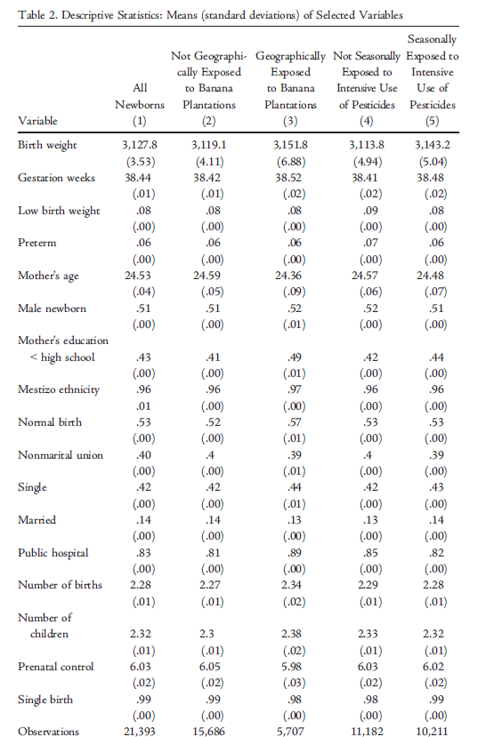

# Introduction 

- Increasing demand for agricultural  productions, combined with land restrictions and changing weather has contribuited to the extensive use of agrochemicals
            
- Issue:This use of chemicals has severe negative effects on the populations living close to the farms or working on them
            
* But, still there are few studies analyzing the effects of enviromental pollution on health outcomes
            
+ very few that leverage quasi-experimental variation to estimate the health effects of the use of pesticides in agriculture
            
 - Goal of this paper: examine the effects of pesticides used in banana plantations in Ecuador on newborn's health outcomes


# Empirical Strategy

- DiD approach that exploits the seasonal changes in the fumigation of banana plantations as an identification strategy
- 4 newborn's health outcomes: weight at birth, gestational length, low birth weight, and preterm
- Use of mother's address durirng pregancy and precise information on the perimeter of the plantations to compute measures of exposure to air pollution
- Compute the mother's distance from the plantation and the area of fumigated plantations near their place of residence


$$
 Y_{ijmy} = \beta_{0} + \beta_{1}\text{Banana Exposure}_{ijmy} + \beta_{2}\text{Intensive Fumigations}_{ijmy} + \\ \theta \text{Banana Exposure}_{ijmy} \times \text{Intensive Fumigations}_{ijmy} + \\  \delta X_{i} + \mu_{j} + \psi_{m} + \pi_{y} + \epsilon_{ijmy} 
$$

$$
 Y_{ijmy} = \beta_{0} + \beta_{1}\text{Banana Exposure}_{ijmy} + \sum_{z=1}^{3} \beta_{z} Z^{th}\text{Intensive Fumigations}_{ijmy} + \\  \sum_{z=1}^{3} \theta_{z} Z^{th}\text{Banana Exposure}_{ijmy} \times   Z^{th}\text{Intensive Fumigations}_{ijmy} + \\  \delta X_{i} + \mu_{j} + \psi_{m} + \pi_{y} + \epsilon_{ijmy}
$$


in which:

- $Y_{ijmy}$: birth outcomes of newborn $i$, in a grid cell $j$, month $m$ and year 
- $\text{Banana Exposure}_{ijmy}$: is a dummy variable that takes the value 1 for newborns from mothers geographically exposed to pesticides
 - $\text{Intensive Fumigations}_{ijmy}$: is a dummy variable that takes the value 1 for newbornds that were affected by intensive fumigations for at least theree months during gestation
- $Z^{th}\text{Intensive Fumigations}_{ijmy}$: is a dummy variable that takes the value 1 for the newbornds that were affected by intensive fumigations during the three months of the $Z^{th}$ gestation trimester.
 - $X$: vector of controls

## Data


```{r, message=FALSE, warning=FALSE}
## 1. Load Packages
library(tidyverse) # Easily Installand Load the 'Tidyverse'
library(lubridate) # Make Dealing with Dates a Little Easier
library(janitor) # Simple Tools for Examining and Cleaning Dirty Data
library(data.table) # Extension of `data.frame`
#library(tidylog) # Logging for 'dplyr' and 'tidyr' Functions
library(haven) # Open .xpt and Stata (.do) files
library(foreign) # Read and Write Data from Other Statistical Systems
library(Hmisc) # Harrell Miscellaneous. Used to extract .dta file label easily
library(htmltools) # Tools for HTML
library(lintr) # Trying to removing the annoying lint
library(gt) # Easily Create Presentation-Ready Display Tables
library(gtExtras) # Additional Functions to Enhance 'gt'
library(broom) # Convert Statistical Analysis Objects into Tidy Tibbles
library(boot) # Bootstrap Functions for R
library(lfe) # Linear Group Fixed Effects
library(sandwich) # For robust standard errors
library(lmtest) # For coefficient testing with robust standard errors
library(plm) # Panel Data Models - to perform OLS with FE
library(tidyr)
library(tidycat)
library(bife)
library(fixest)
library(multiwayvcov)
library(progress)
knitr::opts_chunk$set(fig.width=8, fig.height=8) 
library(here)
bananas1.R <- read_dta("bananas1.dta") # Main dataset used on the papaer
bananas2.R <- read_dta("bananas2.dta") # Dataset used to generate the tables with maternal fixed effects
bananas1 <- bananas1.R %>% clean_names() # Clean the column names
bananas2 <- bananas2.R %>% clean_names() # Clean the column names


```

For **Newborn's health**, the authors collected data from:
        
- dataset from the National Register of Live Births for the period 2015-17  (information on the mother's residential addresses during pregancy)
 - data set includes information on several observable characteristics of children and mothers
On the other hand, the dataset containing information about  **Ecuador's banana plantations:** came from:
 - 2013 agricultural census
 - 2016-18 register of aerial fumigations (geocoded data on the application of the pesticide)


### Table 2



<br>

#### Table 2 <span style="color:blue">replicated</span>


#  Reduced Form estimations

### Table 3


#### Table 3 <span style="color:blue">replicated</span>


### Table 4

<br>

#### Table 4 <span style="color:blue">replicated</span>

### Table 5

#### Table 5 <span style="color:blue">replicated</span>

### Table 6

#### Tablr 6 <span style="color:blue">replicated</span>


